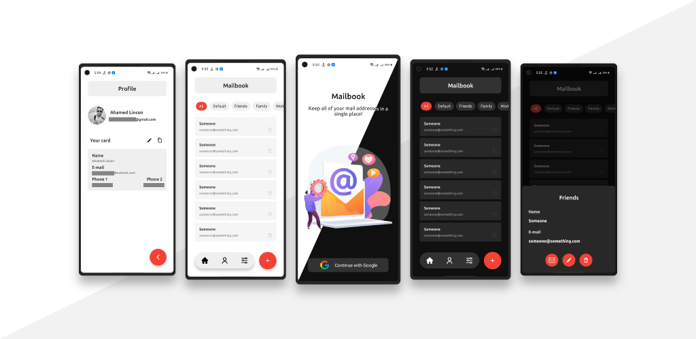

# Mailbook

 

    
   

## About
Mailbook is an application simmilar to a phonebook. Here you can store your E-mail addresses. It uses cloud database and Google authentication.

## Tools

- UI - XML
- Language - Java
- Database - Firebase Firestore, Google Authentication
- Graphics - Adobe Illustrator
- Version Support - Android 6 to Android 11

## White-Space

The application is live on Google Play Store.
Click on the link to download the application!  
https://play.google.com/store/apps/details?id=com.whitespace.mailbook
